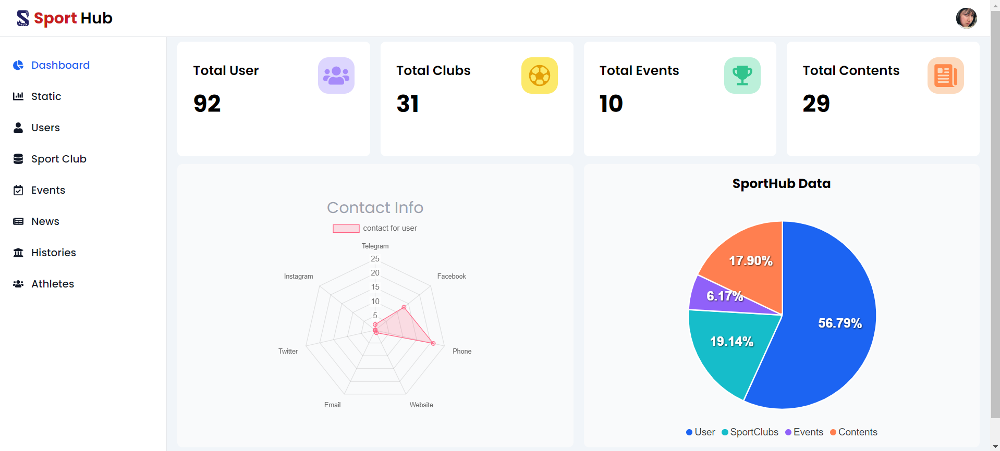

# Final Project readme file

## Welcome to Sport Hub

Sport Hub is your go-to platform for discovering nearby sports clubs, exploring various sports events, and staying informed with the latest sports news. Whether you're searching for the right club or just want to stay connected with the sports community, Sport Hub makes it easy and convenient.

## Get Started

### local installation

1. clone the repo

- git clone: http://git.istad.co:3248/cstad-foundation-2nd-generation/sport-hub/sport-hub-admin.git

2. run the project with live server

- open http://localhost:5173/dashboard with your browser to see the result

## Deployment

- deployment : https://sport-hub-dashboard.vercel.app/dashboard

## Admin Account

- gmail: admin@gmail.com
- password: Admin@12345

## Editor Account

- gmail: makaramouk@gmail.com
- password: Makara88@#$

## Page URL

### Dashboard

#### Admin Feature

1. [Dashboard](https://sport-hub-dashboard.vercel.app/dashboard)
2. [Statistic](https://sport-hub-dashboard.vercel.app/static)
3. [User](https://sport-hub-dashboard.vercel.app/users)
4. [Sport Club](https://sport-hub-dashboard.vercel.app/sport-club)
5. [Event](https://sport-hub-dashboard.vercel.app/events)
6. [News](https://sport-hub-dashboard.vercel.app/news)
7. [Histories](https://sport-hub-dashboard.vercel.app/history)
8. [Athlete](https://sport-hub-dashboard.vercel.app/athlete)

#### Editor Feature

1. [Dashboard](https://sport-hub-dashboard.vercel.app/dashboard)
2. [Statistic](https://sport-hub-dashboard.vercel.app/static)
3. [Sport Club](https://sport-hub-dashboard.vercel.app/sport-club)
4. [Event](https://sport-hub-dashboard.vercel.app/events)
5. [News](https://sport-hub-dash-board-git-main-porkeats-projects.vercel.app/news)
6. [Histories](https://sport-hub-dashboard.vercel.app/history)
7. [Athlete](https://sport-hub-dashboard.vercel.app/athlete)
